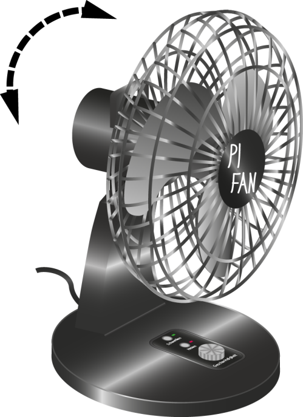
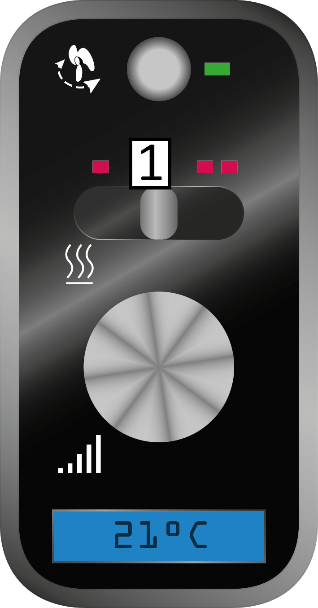
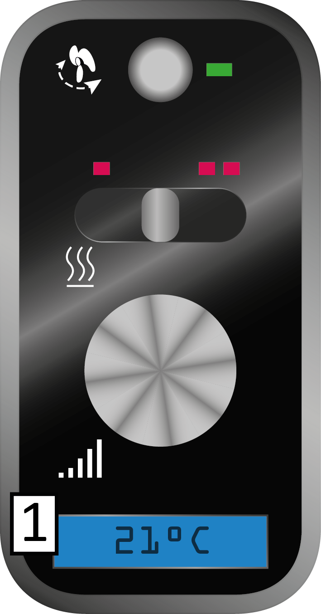

# ShortManual

## Allgemeine Sicherheitshinweise

**Beachten Sie beim Umgang mit dem Gerät die folgenden Sicherheitshinweise.**

|| Warnung! |
|---|---|
|Stromschlag-Gefahr |
|Schützen Sie das Gerät vor Feuchtigkeit und Niederschlag! Nehmen Sie am Gerät nur Veränderungen vor, die ausdrücklich in der Bedienungsanleitung beschrieben sind! |

|| Warnung! |
|---|---|
|Brandgefahr |
|Halten Sie das Gerät während des Betriebs von leicht entzündlichen Stoffen fern! |

||Hinweis |
|---|---|
|Transportschäden |
|Verwenden Sie für den Transport über große Distanzen die vollständige mitgelieferte Verpackung, um Transportschäden am Gerät zu vermeiden! |

## Produktbeschreibung

### Bestimmungsgemäße Verwendung

Nutzen Sie das Gerät nur für die bestimmungsgemäße Verwendung und unter Beachtung der Sicherheitsvorkehrungen, welche in der Bedienungsanleitung beschrieben sind, um Gefährdungen für Personen und Schäden an Gegenständen zu vermeiden.

Die bestimmungsgemäße Verwendung umfasst:

- Belüften von Privat- und Büroräumen oder -raumabschnitten.

- Aufheizen von Privat- und Büroräumen oder -raumabschnitten.

- Das Gerät darf nur bei Temperaturen zwischen -10°C und +40°C betrieben werden.

- Das Gerät darf nur bei Temperaturen zwischen +5°C und +40°C gelagert werden.

- Für den Transport innerhalb von Räumen muss die Tragevorrichtung am Gerät verwendet werden.

- Während des Betriebs muss das Gerät auf seinem Standfuß stehen.

### Vorhersehbarer Fehlgebrauch

Beachten Sie nachfolgende Hinweise, um einen vorhersehbaren Fehlgebrauch zu vermeiden:

- Stellen Sie das Gerät zum Belüften feuchter Kleidungsstücke in einem Mindestabstand von 2 Metern auf und sichern Sie die Kleidungsstücke mit Klammern.

- Sichern Sie das Gerät bei Transport in anderen Behältnissen als der Originalverpackung gegen Umfallen und Stoßschäden.

- Nehmen Sie keine baulichen Veränderungen am Gerät vor, welche nicht in der Bedienungsanleitung beschrieben sind.

- Belasten Sie das Gerät nicht mit anderen Gegenständen.

- Stecken Sie keine Gegenstände oder Körperteile durch das Schutzgitter, während das Gerät mit dem Stromnetz verbunden ist.

- Verwenden Sie das Gerät nur bei einer Luftfeuchtigkeit von höchstens 65%.

- Nutzen Sie das Gerät nicht zum Erwärmen von Gegenständen.

- Stellen Sie das Gerät zum Erwärmen der Raumluft in einem Mindestabstand von 2 Metern zu Personen und Gegenständen auf und schalten Sie die Schwenkfunktion ein (siehe Kapitel 5.1).

### Technische Daten

|**Produkt** | |
|---|---|
|Modell: |T5-DH2 |
|Seriennummer: |123 |
|**Abmaße** | |
|Höhe: |45 cm |
|Standfuß-Durchmesser: |30 cm |
|Rotordurchmesser: |40 cm |
|Gewicht: |2.6 kg |
|**Leistung** | |
|Nennspannung: |230 Volt |
|Leistungsaufnahme: |59 Watt |
|Volumenstrom: |500-3400 m³ pro Stunde |
|**Funktionen** | |
|Geschwindigkeits-steuerung: |5 Stufen |
|Schwenkfunktion: |Ja |
|Höhenverstellbar: |Nein |
|Heizfunktion: |Ja |
|Heizsteuerung: |2 Stufen |
|Neigungswinkel: |-15° / +35° |
|**Sicherheit** | |
|Schutzklasse: |II |

## Bedienung

### Neigung einstellen

***

**Note:**

Der Ventilator hat einen Neigungswinkel von -15° bis +35°. Diesen können Sie schrittweise  in 5°‑Schritten einstellen.

***

***

**Note:**

Hinweis: Ein deutlich hörbares Einrastgeräusch signalisiert, dass sich der Neigungswinkel um eine Stufe geändert hat.

***

***

**Note:**

***

**Steps:**

_Neigung einstellen_

1. Greifen Sie den Ventilator am Griff auf der Oberseite.

2. Neigen Sie den Ventilator, bis er den gewünschten Neigungswinkel erreicht hat.

### Einschalten / Geschwindigkeit einstellen

***

**Note:**

Das Gerät verfügt über 3 / 5 Lüftergeschwindigkeitsstufen.

***

***

**Note:**

 Abhängig von Baureihe:  3-Stufen- oder 5-Stufen-Baureihen

***

***

**Note:**

Mit dem Drehknopf 1 steuern Sie die Geschwindigkeit des Lüfterrades.

***

***

**Note:**

***

***

**Note:**

(ergibt 5_3d)

***

**Steps:**

(ergibt 5_3c)

1. Drehen Sie den Drehknopf eine Stufe nach rechts (im Uhrzeigersinn), wenn das Gerät ausgeschaltet ist, um es einzuschalten.

    ► Das Lüfterrad dreht sich nun auf der geringsten Stufe.

2. Drehen Sie den Drehknopf eine Stufe nach rechts, wenn das Gerät eingeschaltet ist, um die Geschwindigkeit zu erhöhen.

3. Drehen Sie den Drehknopf eine Stufe nach links (gegen den Uhrzeigersinn), um die Geschwindigkeit zu reduzieren.

4. Drehen Sie den Drehknopf ganz nach links (gegen den Uhrzeigersinn), um das Gerät auszuschalten.

    ► Das Gerät ist nun ausgeschaltet und verbraucht keinen Strom mehr.

### Schwenkfunktion ein-/ausschalten

**Steps:**

1. Drücken Sie die Taste 1, bis sie hörbar einrastet, und lassen Sie sie dann los, um die Schwenkfunktion einzuschalten

    ► Die Schwenkfunktion ist nun eingeschaltet und die Taste 1 bleibt gedrückt.

Die grüne LED leuchtet.

2. Drücken Sie die Taste 1 erneut, bis sie hörbar einrastet, und lassen Sie sie dann los, um die Schwenkfunktion auszuschalten

    ► Die Schwenkfunktion ist nun ausgeschaltet und die Taste 1 befindet sich wieder in ihrer Ausgangsposition.

Die grüne LED leuchtet nicht.

### Heizung ein-/ausschalten

**Steps:**

1. Schieben Sie den Schieberegler 1 nach links, um die Heizung auf niedriger Stufe einzuschalten

    ► Die Heizung ist nun auf niedriger Stufe eingeschaltet.

Die einzelne rote LED leuchtet.

2. Schieben Sie den Schieberegler 1 nach rechts, um die Heizung auf hoher Stufe einzuschalten

    ► Die Heizung ist nun auf hoher Stufe eingeschaltet.

Die doppelten roten LEDs leuchten.

3. Schieben Sie den Schieberegler 1 in die Mitte, um die Heizung auszuschalten

    ► Die Heizung ist nun ausgeschaltet.

Keine der roten LEDs leuchtet.

### Display

Das Gerät verfügt über ein Display 1, welches Ihnen die Raumtemperatur in °C anzeigt. Außerdem zeigt das Display alle elektronisch erfassbaren Probleme am Gerät durch Fehlercodes an (siehe Kapitel 7.1).

|  | |
|---|---|