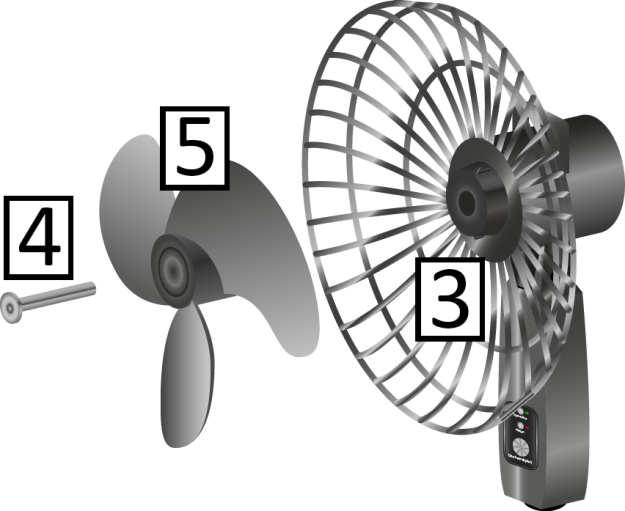
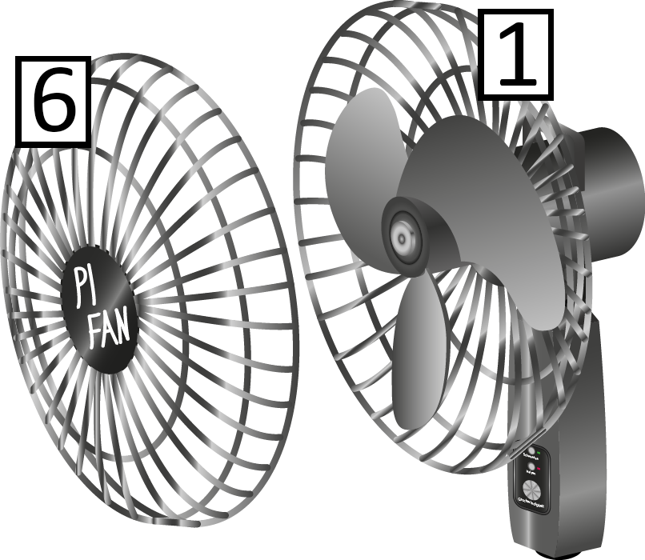
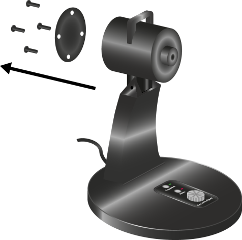

# ReparationManual

## Allgemeine Sicherheitshinweise

**Beachten Sie beim Umgang mit dem Gerät die folgenden Sicherheitshinweise.**

|| Warnung! |
|---|---|
|Stromschlag-Gefahr |
|Schützen Sie das Gerät vor Feuchtigkeit und Niederschlag! Nehmen Sie am Gerät nur Veränderungen vor, die ausdrücklich in der Bedienungsanleitung beschrieben sind! |

||Hinweis |
|---|---|
|Transportschäden |
|Verwenden Sie für den Transport über große Distanzen die vollständige mitgelieferte Verpackung, um Transportschäden am Gerät zu vermeiden! |

## Produktbeschreibung

### Bestimmungsgemäße Verwendung

Nutzen Sie das Gerät nur für die bestimmungsgemäße Verwendung und unter Beachtung der Sicherheitsvorkehrungen, welche in der Bedienungsanleitung beschrieben sind, um Gefährdungen für Personen und Schäden an Gegenständen zu vermeiden.

Die bestimmungsgemäße Verwendung umfasst:

- Belüften von Privat- und Büroräumen oder -raumabschnitten.

- Das Gerät darf nur bei Temperaturen zwischen -10°C und +40°C betrieben werden.

- Das Gerät darf nur bei Temperaturen zwischen +5°C und +40°C gelagert werden.

- Für den Transport innerhalb von Räumen muss die Tragevorrichtung am Gerät verwendet werden.

- Während des Betriebs muss das Gerät auf seinem Standfuß stehen.

### Vorhersehbarer Fehlgebrauch

Beachten Sie nachfolgende Hinweise, um einen vorhersehbaren Fehlgebrauch zu vermeiden:

- Stellen Sie das Gerät zum Belüften feuchter Kleidungsstücke in einem Mindestabstand von 2 Metern auf und sichern Sie die Kleidungsstücke mit Klammern.

- Sichern Sie das Gerät bei Transport in anderen Behältnissen als der Originalverpackung gegen Umfallen und Stoßschäden.

- Nehmen Sie keine baulichen Veränderungen am Gerät vor, welche nicht in der Bedienungsanleitung beschrieben sind.

- Belasten Sie das Gerät nicht mit anderen Gegenständen.

- Stecken Sie keine Gegenstände oder Körperteile durch das Schutzgitter, während das Gerät mit dem Stromnetz verbunden ist.

- Verwenden Sie das Gerät nur bei einer Luftfeuchtigkeit von höchstens 65%.

### Technische Daten

|**Produkt** | |
|---|---|
|Modell: |TP-B |
|Seriennummer: |131 |
|**Abmaße** | |
|Höhe: |45 cm |
|Standfuß-Durchmesser: |30 cm |
|Rotordurchmesser: |40 cm |
|Gewicht: |2.2999999999999998 kg |
|**Leistung** | |
|Nennspannung: |230 Volt |
|Leistungsaufnahme: |43 Watt |
|Volumenstrom: |500-3400 m³ pro Stunde |
|**Funktionen** | |
|Geschwindigkeits-steuerung: |Stufenlos |
|Schwenkfunktion: |Ja |
|Höhenverstellbar: |Nein |
|Heizfunktion: |Nein |
|Heizsteuerung: |- |
|Neigungswinkel: |-15° / +35° |
|**Sicherheit** | |
|Schutzklasse: |II |

## Montage

### Rotor montieren

Sicherheitshinweise

***

**CAUTION**

**Kleinkinder oder Haustiere können Kleinteile verschlucken**

    ► Halten Sie Kleinkinder und Haustiere vom Ort der Montage des Geräts fern, um das Verschlucken von Kleinteilen wie Schrauben zu vermeiden!

***

**Steps:**

_Schutzgitter-Rückseite montieren_

1. Schieben Sie die Schutzgitter-Rückseite 1 auf den Antrieb 2, wie in  zu sehen.

2. Befestigen Sie nun die Schutzgitter-Rückseite 1 mit der  Befestigungsmutter 3, indem Sie sie mit einem Kreuzschlitz-Schraubenzieher handfest anziehen.

    ► Die Schutzgitterrückseite ist nun montiert.

_Rotor montieren_

3. Schieben Sie die Befestigungsschraube 4 durch den Rotor 5.

4. Schieben Sie nun die Befestigungsschraube 4 durch die Befestigungsschraube 3 und ziehen Sie sie mit einem Kreuzschlitz-Schraubenzieher handfest an.

    ► Der Rotor ist nun montiert.

_Schutzgitter-Vorderseite montieren_

5. Legen Sie die Schutzgitter-Vorderseite 6 an die Schutzgitter-Rückseite 1, welche Sie bereits montiert haben, wie in  zu sehen.

6. Fixieren Sie die äußeren Ringe der beiden Gitterhälften aneinander, indem Sie die Befestigungsklammern gleichmäßig verteilt an den beiden aneinanderliegenden Ringen der Schutzgitter-Hälften anbringen.

    ► Die Schutzgitter-Vorderseite ist nun montiert.

► 

_Rotor montiert_

Sie haben den Rotor und das Schutzgitter nun fertig montiert.

## Wartung

### Rotor reinigen

***

**Note:**

Sollten die Flügelräder des Rotors verschmutzt sein, können Sie sie wie folgt reinigen.

***

**Steps:**

1. Trennen Sie das Gerät vom Stromnetz.

2. Entfernen Sie das Schutzgitter.

3. Reinigen Sie den Rotor mit einem feuchten Tuch.

4. Montieren Sie das Schutzgitter.

5. Stellen Sie das Gerät wieder aufrecht hin.

6. Verbinden Sie das Gerät wieder mit dem Stromnetz (siehe Kapitel Inbetriebnahme).

    ► Der Rotor ist nun gereinigt und das Gerät ist wieder betriebsbereit.

## Fehlerbehebung

### Manuelle Fehlerbehebung

Im Folgenden sind häufige Probleme mit möglichen Ursachen und den durchzuführenden Maßnahmen aufgelistet.

#### Der Rotor dreht sich nicht, obwohl das Gerät eingeschaltet ist.

**FAULT:**

**Der Rotor dreht sich nicht, obwohl das Gerät eingeschaltet ist.**

**SOLUTION:**

**Cause:**

Der Elektromotor des Rotors ist defekt.

**Remedy:**

Wenn die Gewährleistungsfrist noch besteht, wenden Sie sich an Ihren Händler

oder lesen Sie im Kapitel 7.5 nach, wie Sie den Elektromotor selbst tauschen

#### Das Gerät lässt sich nicht einschalten.

**FAULT:**

**Das Gerät lässt sich nicht einschalten.**

**SOLUTION:**

**Cause:**

- Der Netzstecker nicht vollständig in die Steckdose gesteckt.

- Die Steckdosenleiste nicht eingeschaltet oder nicht an Steckdose eingesteckt.

- Die Steckdose ist defekt

**Remedy:**

Siehe Kapitel 7.3

### Stromzufuhr prüfen

**Steps:**

1. Vergewissern Sie sich, dass der Netzstecker vollständig in die Steckdose gesteckt wurde

2. Falls Sie das Gerät an einer Steckdosenleiste oder einem Verlängerungskabel betreiben, vergewissern Sie sich, dass die Steckdosenleiste oder das Verlängerungskabel vollständig in die Steckdose gesteckt wurde und eingeschaltet ist

3. Stecken Sie ein anderes Elektrogerät an die verwendete Steckdose und schalten Sie es testweise ein, um die Funktion der Steckdose zu prüfen

### Schwenkbereich freiräumen

***

**Note:**

Wenn die Schwenkfunktion eingeschaltet ist, wird sie ausgeschaltet, wenn sich Gegenstände im Schwenkbereich befinden. Aus Sicherheitsgründen wird dann auch der Rotor ausgeschaltet. Sobald alle störenden Gegenstände entfernt wurden, schaltet sich der Rotor sofort wieder ein und die Schwenkfunktion schaltet sich nach 5 Sekunden wieder ein.

***

***

**Note:**

Führen Sie im Falle einer Störung der Schwenkfunktion bitte folgende Schritte aus:

***

**Steps:**

1. Entfernen Sie alle Gegenstände in einem Radius von 50cm um das Gerät.

2. Entfernen Sie Gegenstände, die von der Decke herab in den Schwenkbereich hängen.

3. Sollten keine Gegenstände das Gerät berühren, prüfen Sie die Stromzufuhr.

4. Sollten Sie nach Durchführung der oben genannten Schritte immer noch Probleme mit der Schwenkfunktion haben, wenden Sie sich bitte an Ihren Händler.

### Elektromotor tauschen

***

**Note:**

Das Gerät verwendet den Elektromotor ABC-123 und darf nur mit diesem betrieben werden!

***

**Steps:**

_: Gehäuseabdeckung entfernen_

1. Trennen Sie das Gerät vom Stromnetz

2. Entfernen Sie den Rotor wieder vom Ventilatorkopf

3. Lösen Sie alle Schrauben an der Rückseite des Ventilatorkopfes

4. Entfernen Sie die Gehäuseabdeckung

5. Tauschen Sie den Elektromotor aus

6. Bringen Sie die Gehäuseabdeckung wieder an

7. Ziehen Sie alle Schrauben an der Rückseite des Ventilatorkopfes handfest an

    ► Sie haben den Elektromotor nun ausgetauscht und können das Gerät wieder in Betrieb nehmen (siehe Kapitel 4)