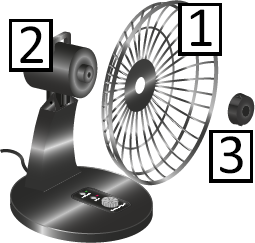
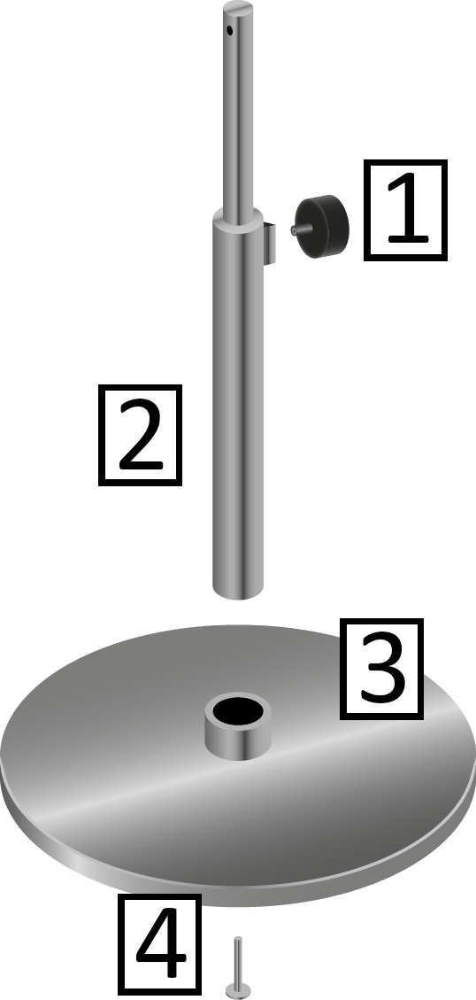
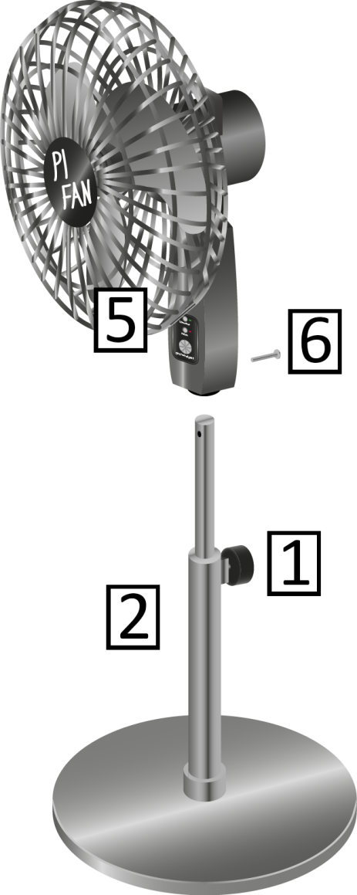
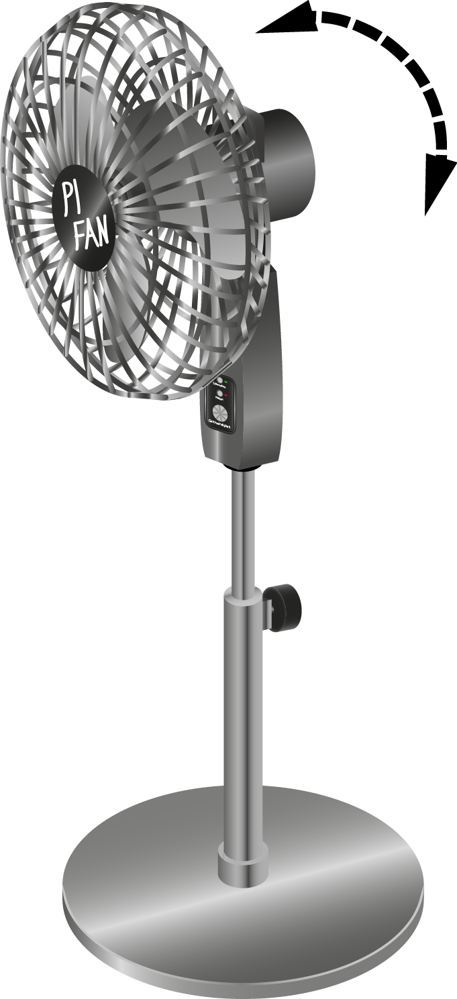
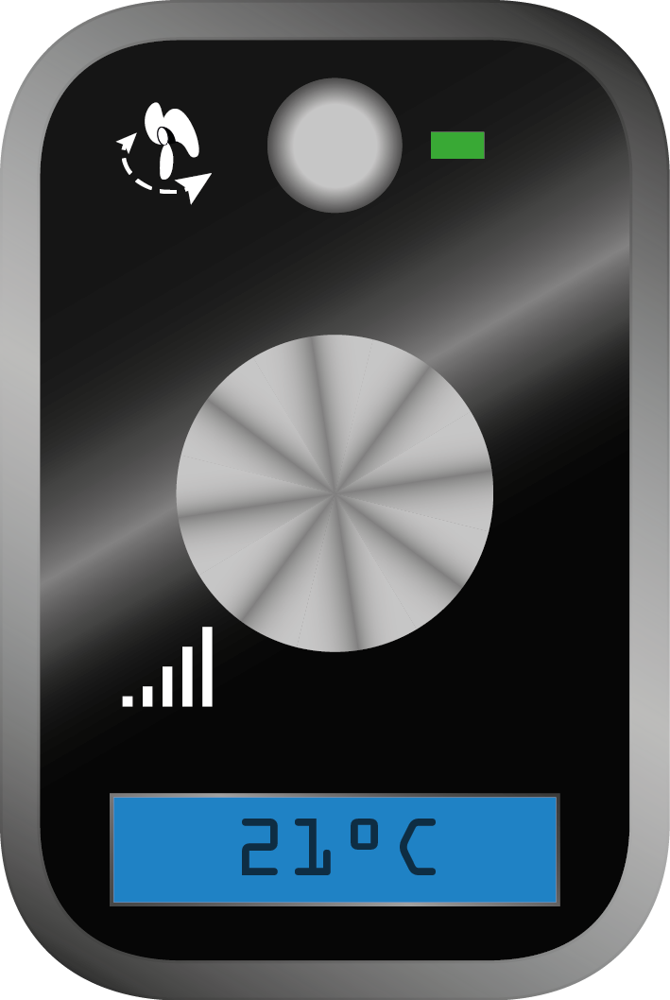

# Manual

## Allgemeine Sicherheitshinweise

**Beachten Sie beim Umgang mit dem Gerät die folgenden Sicherheitshinweise.**

<table>
    <tr>
        <td>

</td>
        <td>

 Warnung!
</td>
    </tr>
    <tr>
        <td>
Stromschlag-Gefahr
</td>
    </tr>
    <tr>
        <td>
Schützen Sie das Gerät vor Feuchtigkeit und Niederschlag!

Nehmen Sie am Gerät nur Veränderungen vor, die ausdrücklich in der Bedienungsanleitung beschrieben sind!
</td>
    </tr>
</table>

<table>
    <tr>
        <td>

</td>
        <td>

 Vorsicht!
</td>
    </tr>
    <tr>
        <td>
Verletzungsgefahr durch Umfallen
</td>
    </tr>
    <tr>
        <td>
Stellen Sie das Gerät nur auf ebene Flächen, um Verletzungen an Personen und Haustieren sowie Schäden an Gegenständen zu vermeiden!

Halten Sie Kleinkinder und Haustiere von dem Gerät fern!
</td>
    </tr>
</table>

<table>
    <tr>
        <td>

</td>
        <td>
Hinweis
</td>
    </tr>
    <tr>
        <td>
Transportschäden
</td>
    </tr>
    <tr>
        <td>
Verwenden Sie für den Transport über große Distanzen die vollständige mitgelieferte Verpackung, um Transportschäden am Gerät zu vermeiden!
</td>
    </tr>
</table>

## Produktbeschreibung

### Bestimmungsgemäße Verwendung

Nutzen Sie das Gerät nur für die bestimmungsgemäße Verwendung und unter Beachtung der Sicherheitsvorkehrungen, welche in der Bedienungsanleitung beschrieben sind, um Gefährdungen für Personen und Schäden an Gegenständen zu vermeiden.

Die bestimmungsgemäße Verwendung umfasst:

- Belüften von Privat- und Büroräumen oder -raumabschnitten.

- Das Gerät darf nur bei Temperaturen zwischen -10°C und +40°C betrieben werden.

- Das Gerät darf nur bei Temperaturen zwischen +5°C und +40°C gelagert werden.

- Für den Transport innerhalb von Räumen muss die Tragevorrichtung am Gerät verwendet werden.

- Während des Betriebs muss das Gerät auf seinem Standfuß stehen.

### Vorhersehbarer Fehlgebrauch

Beachten Sie nachfolgende Hinweise, um einen vorhersehbaren Fehlgebrauch zu vermeiden:

- Stellen Sie das Gerät zum Belüften feuchter Kleidungsstücke in einem Mindestabstand von 2 Metern auf und sichern Sie die Kleidungsstücke mit Klammern.

- Sichern Sie das Gerät bei Transport in anderen Behältnissen als der Originalverpackung gegen Umfallen und Stoßschäden.

- Nehmen Sie keine baulichen Veränderungen am Gerät vor, welche nicht in der Bedienungsanleitung beschrieben sind.

- Belasten Sie das Gerät nicht mit anderen Gegenständen.

- Stecken Sie keine Gegenstände oder Körperteile durch das Schutzgitter, während das Gerät mit dem Stromnetz verbunden ist.

- Verwenden Sie das Gerät nur bei einer Luftfeuchtigkeit von höchstens 65%.

### Technische Daten

<table>
    <tr>
        <td>
**Produkt**
</td>
        <td>

</td>
    </tr>
    <tr>
        <td>
Modell:
</td>
        <td>
XP-D
</td>
    </tr>
    <tr>
        <td>
Seriennummer:
</td>
        <td>
232
</td>
    </tr>
    <tr>
        <td>
**Abmaße**
</td>
        <td>

</td>
    </tr>
    <tr>
        <td>
Höhe:
</td>
        <td>
100-160 cm
</td>
    </tr>
    <tr>
        <td>
Standfuß-Durchmesser:
</td>
        <td>
70 cm
</td>
    </tr>
    <tr>
        <td>
Rotordurchmesser:
</td>
        <td>
60 cm
</td>
    </tr>
    <tr>
        <td>
Gewicht:
</td>
        <td>
4.5999999999999996 kg
</td>
    </tr>
    <tr>
        <td>
**Leistung**
</td>
        <td>

</td>
    </tr>
    <tr>
        <td>
Nennspannung:
</td>
        <td>
230 Volt
</td>
    </tr>
    <tr>
        <td>
Leistungsaufnahme:
</td>
        <td>
50 Watt
</td>
    </tr>
    <tr>
        <td>
Volumenstrom:
</td>
        <td>
900-4800 m³ pro Stunde
</td>
    </tr>
    <tr>
        <td>
**Funktionen**
</td>
        <td>

</td>
    </tr>
    <tr>
        <td>
Geschwindigkeits-steuerung:
</td>
        <td>
Stufenlos
</td>
    </tr>
    <tr>
        <td>
Schwenkfunktion:
</td>
        <td>
Ja
</td>
    </tr>
    <tr>
        <td>
Höhenverstellbar:
</td>
        <td>
Ja
</td>
    </tr>
    <tr>
        <td>
Heizfunktion:
</td>
        <td>
Nein
</td>
    </tr>
    <tr>
        <td>
Heizsteuerung:
</td>
        <td>
-
</td>
    </tr>
    <tr>
        <td>
Neigungswinkel:
</td>
        <td>
-15° / +35°
</td>
    </tr>
    <tr>
        <td>
**Sicherheit**
</td>
        <td>

</td>
    </tr>
    <tr>
        <td>
Schutzklasse:
</td>
        <td>
II
</td>
    </tr>
</table>

## Montage

### Rotor montieren

Sicherheitshinweise

***

**CAUTION**

**Kleinkinder oder Haustiere können Kleinteile verschlucken**

    ► Halten Sie Kleinkinder und Haustiere vom Ort der Montage des Geräts fern, um das Verschlucken von Kleinteilen wie Schrauben zu vermeiden!

***

**Steps:**

_: Schutzgitter-Rückseite montieren_

1. Schieben Sie die Schutzgitter-Rückseite 1 auf den Antrieb 2, wie in  zu sehen.

2. Befestigen Sie nun die Schutzgitter-Rückseite mit der  Befestigungsmutter 3, indem Sie sie mit einem Kreuzschlitz-Schraubenzieher handfest anziehen.

    ► Die Schutzgitterrückseite ist nun montiert.

_: Rotor montieren_

3. Schieben Sie die Befestigungsschraube 4 durch den Rotor 5.

4. Schieben Sie nun die Befestigungsschraube 4 durch die Befestigungsschraube 3 und ziehen Sie sie mit einem Kreuzschlitz-Schraubenzieher handfest an.

    ► Der Rotor ist nun montiert.

_: Schutzgitter-Vorderseite montieren_

5. Legen Sie die Schutzgitter-Vorderseite 6 an die Schutzgitter-Rückseite 1, welche Sie bereits montiert haben, wie in  zu sehen.

6. Fixieren Sie die äußeren Ringe der beiden Gitterhälften aneinander, indem Sie die Befestigungsklammern gleichmäßig verteilt an den beiden aneinanderliegenden Ringen der Schutzgitterhälften anbringen.

    ► Die Schutzgitter-Vorderseite ist nun montiert.

► 

_: Rotor montiert_

Sie haben den Rotor und das Schutzgitter nun fertig montiert.

### Teleskopstange und Standplatte montieren

**Steps:**

_: Bodenständer montieren_

1. Befestigen Sie die Justierschraube 1 an der Teleskopstange 2, wie in  zu sehen und ziehen Sie die Justierschraube handfest an.

2. Stecken Sie die Teleskopstange 2 in die runde Aussparung an der Oberseite des Bodenständers 3.

3. Befestigen Sie die Teleskopstange 2 am Bodenständer 3, indem Sie die Befestigungsschraube 4 durch den Bodenständer stecken, und handfest anziehen.

    ► Die Teleskopstange ist nun am Bodenständer befestigt.

_: Teleskopstange mit Funktionseinheit verbinden_

4. Stecken Sie die Funktionseinheit 5, an der Sie bereits das Schutzgitter und den Rotor montiert haben, auf die Teleskopstange, wie in  zu sehen

5. Verdrehen Sie die Funktionseinheit 5 auf der Teleskopstange 2, bis die Justierschraube 1 auf der Rückseite ist und sich die Bohrungen an der Teleskopstange und der Rückseite der Funktionseinheit decken

6. Befestigen Sie die Funktionseinheit 5 an der Teleskopstange 2, indem Sie die Befestigungsschraube 6 durch die Rückseite des Bedienteils und die Teleskopstange stecken und handfest anziehen

    ► Die Funktionseinheit ist nun auf der Teleskopstange montiert.

► 

_: Gerät fertig montiert_

Sie haben das Gerät nun vollständig montiert und können es nun in Betrieb nehmen.

## Inbetriebnahme

***

**Note:**

Das Gerät wird mit einer Netzspannung von 230V Wechselstrom betrieben. Schließen Sie das Gerät wie im Folgenden beschrieben an das Stromnetz an.

***

**Steps:**

_: Anschluss an das Stromnetz_

1. Vergewissern Sie sich, dass am Netzstecker (A) und an der Steckdose, an welcher Sie das Gerät betreiben wollen, keine Beschädigungen sind.

2. Verbinden Sie den Netzstecker (A) mit der Steckdose (B).

    ► Das Gerät ist nun einsatzbereit.

## Bedienung

### Höhe einstellen

***

**Note:**

Die Höhe des Geräts ist stufenlos einstellbar.

***

***

**Note:**

***

**Steps:**

_: Höhe einstellen_

1. Greifen Sie die Funktionseinheit 1 am Griff auf der Oberseite.

2. Lösen Sie mit der anderen Hand die Halteschraube 2 an der Rückseite der Teleskopstange.

3. Ziehen Sie die Funktionseinheit 1 auf die gewünschte Höhe.

4. Ziehen  Sie die Halteschraube 2 mit der Hand wieder handfest an

5. Lassen Sie den Griff los.

    ► Das Gerät hat nun die gewünschte Höhe

### Neigung einstellen

***

**Note:**

Der Ventilator hat einen Neigungswinkel von -15° bis +35°. Diesen können Sie schrittweise  in 5°‑Schritten einstellen.

***

***

**Note:**

Hinweis: Ein deutlich hörbares Einrastgeräusch signalisiert, dass sich der Neigungswinkel um eine Stufe geändert hat.

***

***

**Note:**

***

**Steps:**

_: Neigung einstellen_

1. Greifen Sie den Ventilator am Griff auf der Oberseite.

2. Neigen Sie den Ventilator, bis er den gewünschten Neigungswinkel erreicht hat.

### Einschalten / Geschwindigkeit einstellen

***

**Note:**

Das Gerät verfügt über eine stufenlose Lüftersteuerung.

***

***

**Note:**

Mit dem Drehknopf 1 steuern Sie die Geschwindigkeit des Lüfterrades.

***

***

**Note:**

***

**Steps:**

(ergibt 5_3h)

1. Drehen Sie den Drehknopf nach rechts (im Uhrzeigersinn), wenn das Gerät ausgeschaltet ist, um es einzuschalten.

    ► Das Lüfterrad dreht sich nun auf der geringsten Stufe.

2. Drehen Sie den Drehknopf weiter nach rechts, wenn das Gerät eingeschaltet ist, um die Geschwindigkeit zu erhöhen.

3. Drehen Sie den Drehknopf nach links (gegen den Uhrzeigersinn), um die Geschwindigkeit zu reduzieren.

4. Drehen Sie den Drehknopf ganz nach links (gegen den Uhrzeigersinn), um das Gerät auszuschalten.

    ► Das Gerät ist nun ausgeschaltet und verbraucht keinen Strom mehr.

### Schwenkfunktion ein-/ausschalten

**Steps:**

1. Drücken Sie die Taste 1, bis sie hörbar einrastet, und lassen Sie sie dann los, um die Schwenkfunktion einzuschalten

    ► Die Schwenkfunktion ist nun eingeschaltet und die Taste 1 bleibt gedrückt.

Die grüne LED leuchtet.

2. Drücken Sie die Taste 1 erneut, bis sie hörbar einrastet, und lassen Sie sie dann los, um die Schwenkfunktion auszuschalten

    ► Die Schwenkfunktion ist nun ausgeschaltet und die Taste 1 befindet sich wieder in ihrer Ausgangsposition.

Die grüne LED leuchtet nicht.

### Display

Das Gerät verfügt über ein Display 1, welches Ihnen die Raumtemperatur in °C anzeigt. Außerdem zeigt das Display alle elektronisch erfassbaren Probleme am Gerät durch Fehlercodes an (siehe Kapitel 7.1).

<table>
    <tr>
        <td>

</td>
        <td>

</td>
    </tr>
</table>

## Wartung

### Rotor reinigen

***

**Note:**

Sollten die Flügelräder des Rotors verschmutzt sein, können Sie sie wie folgt reinigen.

***

**Steps:**

1. Trennen Sie das Gerät vom Stromnetz.

2. Entfernen Sie das Schutzgitter.

3. Reinigen Sie den Rotor mit einem feuchten Tuch.

4. Montieren Sie das Schutzgitter.

5. Stellen Sie das Gerät wieder aufrecht hin.

6. Verbinden Sie das Gerät wieder mit dem Stromnetz (siehe Kapitel Inbetriebnahme).

    ► Der Rotor ist nun gereinigt und das Gerät ist wieder betriebsbereit.

## Fehlerbehebung

### Fehlercodes am Display

Im Fall von elektronisch erfassbaren Komplikationen werden auf dem Display Fehlercodes angezeigt. Nachfolgend werden diese Fehlercodes mit den möglichen Ursachen und den durchzuführenden Maßnahmen aufgelistet.

#### 2X222

**FAULT:**

**2X222**

**SOLUTION:**

**Cause:**

Stellmotor blockiert

**Remedy:**

Siehe Kapitel 7.3

#### 5X555

**FAULT:**

**5X555**

**SOLUTION:**

**Cause:**

Elektromotor defekt

**Remedy:**

Lassen Sie den Elektromotor auswechseln

oder wechseln Sie den Elektromotor selbst aus (siehe Kapitel 7.4)

#### 1X111

**FAULT:**

**1X111**

**SOLUTION:**

**Cause:**

Steuerung defekt

**Remedy:**

Lassen Sie das Bedienteil auswechseln

### Manuelle Fehlerbehebung

Nicht alle Probleme sind elektronisch erfassbar.

Im Folgenden sind häufige Probleme mit möglichen Ursachen und den durchzuführenden Maßnahmen aufgelistet.

#### Das Gerät lässt sich nicht einschalten.

**FAULT:**

**Das Gerät lässt sich nicht einschalten.**

**SOLUTION:**

**Cause:**

- Der Netzstecker nicht vollständig in die Steckdose gesteckt.

- Die Steckdosenleiste nicht eingeschaltet oder nicht an Steckdose eingesteckt.

- Die Steckdose ist defekt

**Remedy:**

Siehe Kapitel 7.3

### Stromzufuhr prüfen

**Steps:**

1. Vergewissern Sie sich, dass der Netzstecker vollständig in die Steckdose gesteckt wurde

2. Falls Sie das Gerät an einer Steckdosenleiste oder einem Verlängerungskabel betreiben, vergewissern Sie sich, dass die Steckdosenleiste oder das Verlängerungskabel vollständig in die Steckdose gesteckt wurde und eingeschaltet ist

3. Stecken Sie ein anderes Elektrogerät an die verwendete Steckdose und schalten Sie es testweise ein, um die Funktion der Steckdose zu prüfen

### Schwenkbereich freiräumen

***

**Note:**

Wenn die Schwenkfunktion eingeschaltet ist, wird sie ausgeschaltet, wenn sich Gegenstände im Schwenkbereich befinden. Aus Sicherheitsgründen wird dann auch der Rotor ausgeschaltet. Sobald alle störenden Gegenstände entfernt wurden, schaltet sich der Rotor sofort wieder ein und die Schwenkfunktion schaltet sich nach 5 Sekunden wieder ein.

***

***

**Note:**

Führen Sie im Falle einer Störung der Schwenkfunktion bitte folgende Schritte aus:

***

**Steps:**

1. Entfernen Sie alle Gegenstände in einem Radius von 50cm um das Gerät.

2. Entfernen Sie Gegenstände, die von der Decke herab in den Schwenkbereich hängen.

3. Sollten keine Gegenstände das Gerät berühren, prüfen Sie die Stromzufuhr.

4. Sollten Sie nach Durchführung der oben genannten Schritte immer noch Probleme mit der Schwenkfunktion haben, wenden Sie sich bitte an Ihren Händler.

### Elektromotor tauschen

***

**Note:**

Das Gerät verwendet den Elektromotor ABC-123 und darf nur mit diesem betrieben werden!

***

**Steps:**

_: Gehäuseabdeckung entfernen_

1. Trennen Sie das Gerät vom Stromnetz

2. Entfernen Sie den Rotor wieder vom Ventilatorkopf

3. Lösen Sie alle Schrauben an der Rückseite des Ventilatorkopfes

4. Entfernen Sie die Gehäuseabdeckung

5. Tauschen Sie den Elektromotor aus

6. Bringen Sie die Gehäuseabdeckung wieder an

7. Ziehen Sie alle Schrauben an der Rückseite des Ventilatorkopfes handfest an

    ► Sie haben den Elektromotor nun ausgetauscht und können das Gerät wieder in Betrieb nehmen (siehe Kapitel 4)

## Kontaktdaten

**Unsere Website:**

[www.pi-fan.de](http://www.pi-fan.de)

[www.pi-class.i4icm.de](http://www.pi-class.i4icm.de)

**Copyright:**

Copyright (c) 2015, the  PI-Fan Project by STZ I4ICM

Contributors to the PI-Fan Project (1.0):

W. Ziegler

Contributors to the PI-Fan Project (1.1):

R. Gruenert, W. Ziegler

Permission is hereby granted, free of charge, to any person obtaining a copy

of this software and associated documentation files (the "Software"), to deal

in the Software without restriction, including without limitation the rights

to use, copy, modify, merge, publish, distribute, sublicense, and/or sell

copies of the Software, and to permit persons to whom the Software is

furnished to do so, subject to the following conditions:

The above copyright notice and this permission notice shall be included in

all copies or substantial portions of the Software.

THE SOFTWARE IS PROVIDED "AS IS", WITHOUT WARRANTY OF ANY KIND, EXPRESS OR

IMPLIED, INCLUDING BUT NOT LIMITED TO THE WARRANTIES OF MERCHANTABILITY,

FITNESS FOR A PARTICULAR PURPOSE AND NONINFRINGEMENT. IN NO EVENT SHALL THE

AUTHORS OR COPYRIGHT HOLDERS BE LIABLE FOR ANY CLAIM, DAMAGES OR OTHER

LIABILITY, WHETHER IN AN ACTION OF CONTRACT, TORT OR OTHERWISE, ARISING FROM,

OUT OF OR IN CONNECTION WITH THE SOFTWARE OR THE USE OR OTHER DEALINGS IN

THE SOFTWARE.

## Entsorgung

Das Gerät unterliegt den Entsorgungsbestimmungen für Elektrogeräte. Für die Entsorgung des Geräts stehen Ihnen zwei Optionen zur Verfügung:

**Option 1**

Entsorgen Sie die Bestandteile des Geräts selbst in den dafür vorgesehenen Behältern.

<table>
    <tr>
        <td>
**Bauteil / Baugruppe**
</td>
        <td>
**Vorgesehener Behälter**
</td>
    </tr>
    <tr>
        <td>
Metallteile
</td>
        <td>
Sondermüll
</td>
    </tr>
    <tr>
        <td>
Kunststoffteile
</td>
        <td>
Recyclingbehälter
</td>
    </tr>
    <tr>
        <td>
Folieverpackung
</td>
        <td>
Recyclingbehälter
</td>
    </tr>
    <tr>
        <td>
Kartonverpackung
</td>
        <td>
Papier-Mülltonne
</td>
    </tr>
</table>

**Option 2**

Geben Sie das Gerät bei Ihrem Elektrofachhändler oder Ihrer kommunalen Übergabestelle für Elektrogeräte ab. Diese sind nach Elektro- und Elektronikgeräte-Gesetz (ElektroG) dazu verpflichtet, Elektro(klein)geräte entgegenzunehmen.